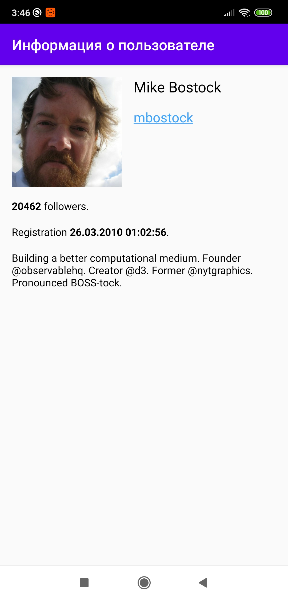

# Test task for Chulakov

- [Operations](#operations)
- [Screenshots](#screenshots)
  - [Portrait](#portrait)
  - [Landscape](#landscape)
- [Entities](#entities)
- [Links](#links)

<h2>Operations</h2>
<p><b>GET</b> /search/users <b>(page, per_page, q)</b></p>
<p><b>GET</b> /users/{login}</p>

<h2>Screenshots</h2>
<p>Screenshots in full resolution.</p>
<h3>Portrait </h3>
<div style="display:flex;">


</div>
<h3>Landscape</h3>
<div style="display:flex;">
<p></p>
</div>


<h3>Entities</h3>
```kotlin
class SearchResults<T> (
    val total_count : Int,
    val incomplete_results : Boolean,
    val items : List<T>
)
```

<h3>Links</h3>
<p><a href='https://chulakov.ru/career/android-razrabotchik'>Android-разработчик</a></p>
<p><a href='https://docs.google.com/document/d/1mldQnn-hJFgoAsJxkc6qK4LoZrYgrgNORgowgu89uaE/'>Работа с Github API</a></p>
